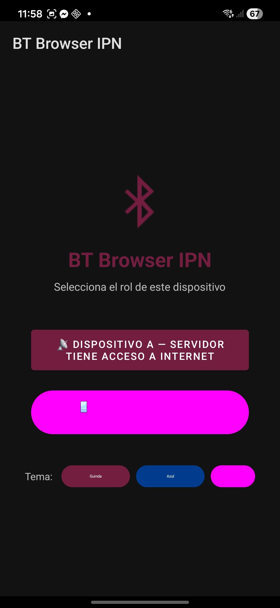
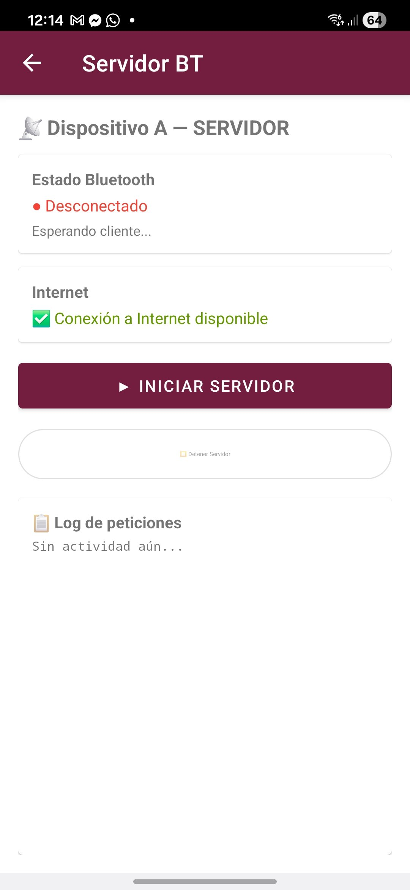
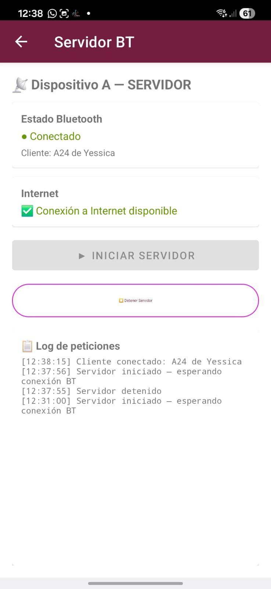
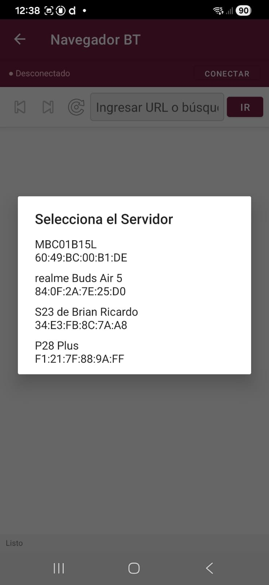
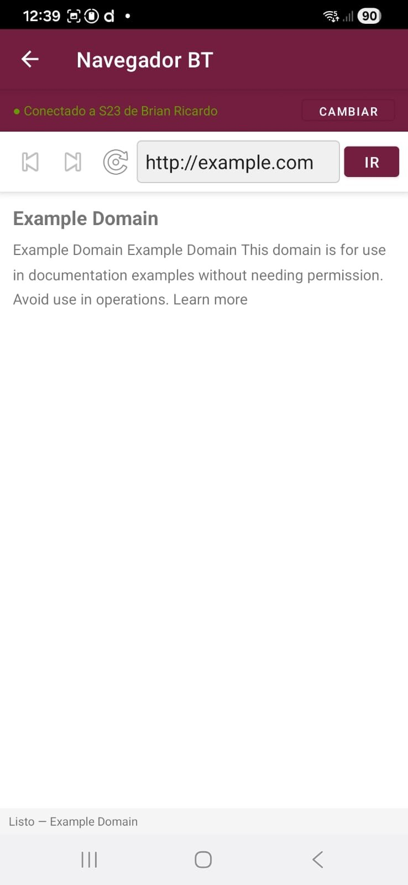

# 📡 BT Browser IPN — Práctica 6

Navegador web que funciona sin Internet en el dispositivo cliente, usando Bluetooth como canal de comunicación hacia un dispositivo servidor que sí tiene conexión.

---

## 🧠 Arquitectura

```
[Dispositivo B — Cliente]  ←──Bluetooth RFCOMM──→  [Dispositivo A — Servidor]
   Sin Internet                                          Con Internet
   Envía URL                                            Fetch HTTP
   Recibe contenido                                     Devuelve respuesta
```

El **Dispositivo A** actúa como proxy: recibe peticiones HTTP del cliente por Bluetooth, las ejecuta localmente y regresa el contenido en chunks de 512 caracteres.

---

## 📸 Capturas de pantalla

### 1. Pantalla de selección de rol
El usuario elige si su dispositivo actuará como Servidor (A) o Cliente (B). Incluye selector de tema de color.

<p align="center">
  
</p>

---

### 2. Servidor — Esperando cliente
El Dispositivo A inicia el servidor RFCOMM y queda en espera de conexión Bluetooth entrante. Muestra el estado de Internet disponible.

<p align="center">
  
</p>

---

### 3. Servidor — Cliente conectado
Una vez que el Dispositivo B se conecta, el servidor muestra el nombre del cliente y registra la actividad en el log de peticiones.

<p align="center">
  
</p>

---

### 4. Cliente — Selección de servidor
El Dispositivo B muestra la lista de dispositivos Bluetooth pareados para que el usuario seleccione cuál es el servidor.

<p align="center">
  
</p>

---

### 5. Cliente — Navegación exitosa
El Dispositivo B navega a `http://example.com` sin tener Internet propio. El contenido fue obtenido por el Servidor A y transmitido por Bluetooth.

<p align="center">
  
</p>

---

## ⚙️ Funcionalidades

| Característica | Descripción |
|---|---|
| Proxy Bluetooth | Comunicación vía RFCOMM (canal seguro) |
| Caché LRU | Hasta 50 URLs en memoria — evita fetches repetidos |
| Transmisión en chunks | Respuestas divididas en bloques de 512 caracteres |
| Historial de navegación | Botones atrás/adelante |
| Log de peticiones | Registro con timestamps en el servidor |
| Selector de tema | Guinda, Azul, Rosa |

## 🔐 Permisos requeridos

```xml
BLUETOOTH, BLUETOOTH_ADMIN, BLUETOOTH_CONNECT,
BLUETOOTH_SCAN, BLUETOOTH_ADVERTISE,
ACCESS_FINE_LOCATION, ACCESS_COARSE_LOCATION,
INTERNET, ACCESS_NETWORK_STATE,
FOREGROUND_SERVICE, POST_NOTIFICATIONS
```

## 👥 Autores

| Nombre | Rol |
|---|---|
| Brian Ricardo | Desarrollo |
| Karla Sofía | Desarrollo |

**ESCOM — IPN · Desarrollo de Aplicaciones Móviles Nativas · 6CV2**
