# Práctica 4 — Manejo de Archivos en Android.

| Campo | Datos |
|---|---|
| **Integrantes** | Bernal Ramírez Brian Ricardo / Saavedra Mata Karla Sofía |
| **Boletas** | 2023630387 / 2019300048 |
| **Asignatura** | Desarrollo de Aplicaciones Móviles Nativas |
| **Profesor** | Gabriel Hurtado Avilés |
| **Fecha de entrega** | 15 de mayo de 2026 |
| **Institución** | Instituto Politécnico Nacional — Escuela Superior de Cómputo |

---

## Introducción

Esta práctica tiene como objetivo desarrollar aplicaciones nativas para Android que implementen técnicas avanzadas de manejo de archivos, incluyendo almacenamiento local, lectura y escritura en diferentes formatos, y visualización de contenido multimedia.

Se desarrollaron dos aplicaciones:

- **File Manager IPN** — Explorador y gestor de archivos completo con visualizadores de texto, JSON, XML e imágenes, sistema de favoritos y historial de recientes.
- **Memory Game IPN** *(Parte 2)* — Juego de memoria con persistencia de partidas en formatos TXT, JSON y XML.

Ambas aplicaciones fueron desarrolladas en **Kotlin**, siguen el patrón de arquitectura **MVVM**, y son compatibles con **Android 7.0 (API 24)** o superior. Funcionan completamente **sin conexión a Internet**.

---

## Parte 1: File Manager IPN

### Instalación

```bash
git clone https://github.com/zahirobrian/practica4.git
```

1. Abre Android Studio → **Open** → selecciona `FileManagerIPN/`
2. Espera el Gradle Sync
3. Conecta dispositivo o emulador (API 24+)
4. **Run 'app'**

> **Gradle JDK requerido:** JDK 17. Configúralo en `File → Settings → Build → Gradle → Gradle JDK`

---

## Desarrollo

### Pantalla de Inicio

Al iniciar la aplicación se muestra una pantalla de splash con el ícono de la app en color guinda representativo del IPN.

<p align="center">
  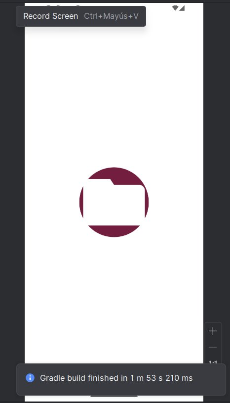
</p>
<p align="center"><i>Figura 1. Pantalla de inicio</i></p>

---

### Solicitud de Permisos

La aplicación solicita permisos de acceso al almacenamiento en tiempo de ejecución con mensajes claros para el usuario. En Android 13+ se solicitan permisos granulares (`READ_MEDIA_IMAGES`, `READ_MEDIA_AUDIO`, `READ_MEDIA_VIDEO`).

<p align="center">
  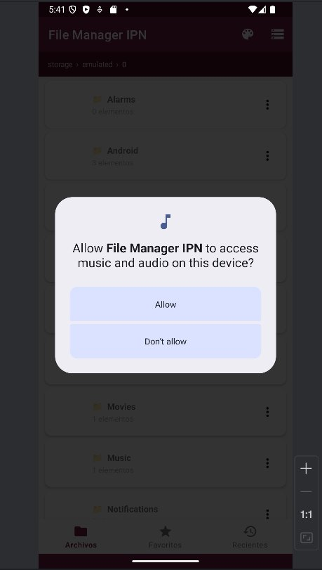
</p>
<p align="center"><i>Figura 2. Diálogo de solicitud de permisos</i></p>

---

### Temas Personalizables

La aplicación implementa dos temas institucionales seleccionables desde el menú de la toolbar. Ambos se adaptan automáticamente al modo claro/oscuro del sistema operativo.

<p align="center">
  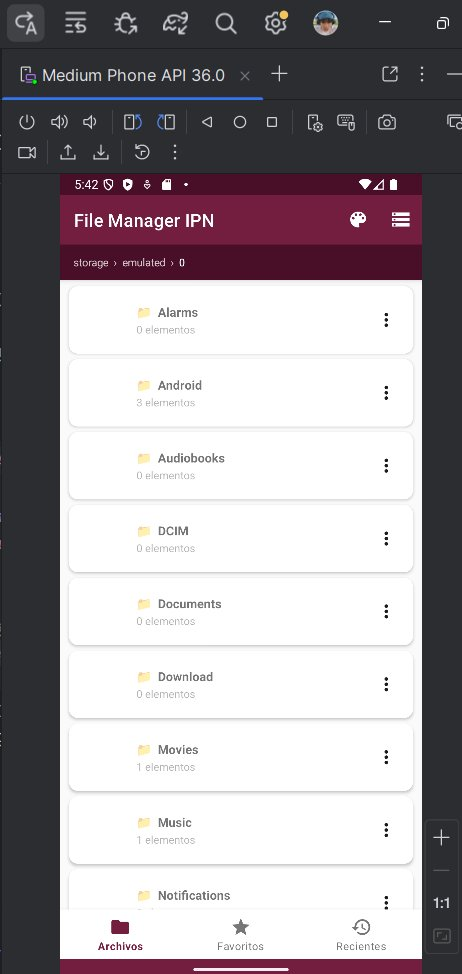
  &nbsp;&nbsp;&nbsp;
  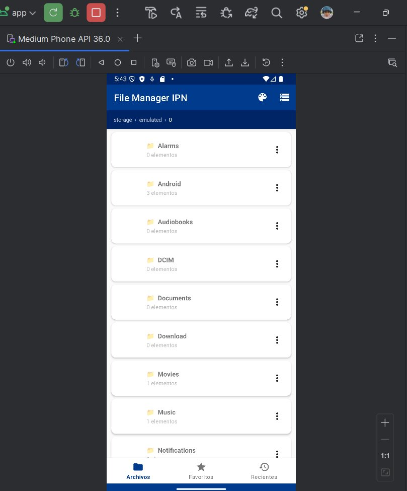
</p>
<p align="center"><i>Figura 3. Tema Guinda (IPN) — Tema Azul (ESCOM)</i></p>

---

### Navegación con Breadcrumb

La interfaz incluye una barra de breadcrumb interactiva que muestra la ruta jerárquica actual. Cada segmento es clickeable y permite navegar directamente a cualquier nivel superior.

<p align="center">
  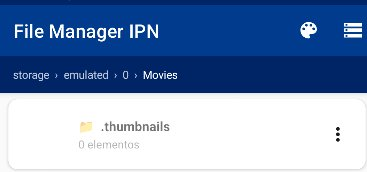
</p>
<p align="center"><i>Figura 4. Breadcrumb mostrando la ruta: storage › emulated › 0 › Movies</i></p>

---

### Estado de Carpeta Vacía

Cuando el directorio explorado no contiene archivos, se muestra un estado vacío con ícono y mensaje descriptivo.

<p align="center">
  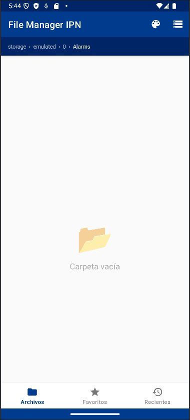
</p>
<p align="center"><i>Figura 5. Pantalla de carpeta vacía</i></p>

---

### Menú Contextual de Operaciones

Al tocar el botón ⋮ de cualquier archivo o carpeta, se despliega un menú contextual con todas las operaciones disponibles.

<p align="center">
  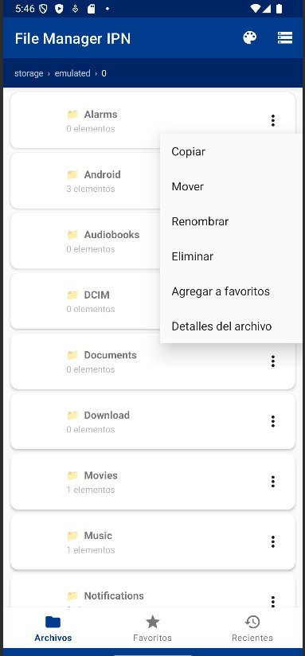
</p>
<p align="center"><i>Figura 6. Menú contextual: Copiar, Mover, Renombrar, Eliminar, Agregar a favoritos, Detalles del archivo</i></p>

---

### Visualizador con Resaltado de Sintaxis XML

La aplicación visualiza archivos XML con resaltado de sintaxis usando `SpannableString`. Las etiquetas se muestran en rojo, los atributos en amarillo y los valores en verde. La barra superior muestra los metadatos: tamaño, fecha de modificación y tipo MIME.

<p align="center">
  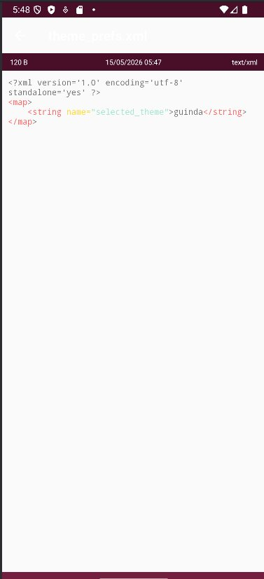
</p>
<p align="center"><i>Figura 7. Visualizador XML con resaltado de sintaxis y metadatos</i></p>

---

## Implementación

### Arquitectura MVVM

```
View        →  MainActivity, Fragments, FileAdapter, FileViewerActivity
ViewModel   →  FileViewModel (LiveData + Coroutines)
Model       →  AppDatabase (Room), FavoriteDao, FileUtils, ThemeManager
```

### Lectura de archivos

```kotlin
val content = withContext(Dispatchers.IO) {
    file.readText(Charsets.UTF_8)
}
```

### Detección de tipo MIME

```kotlin
MimeTypeMap.getSingleton()
    .getMimeTypeFromExtension(file.extension.lowercase())
    ?: "application/octet-stream"
```

### Resaltado de sintaxis (JSON / XML)

El resaltado se implementa con `SpannableString` y expresiones regulares sin librerías externas. Se aplican `ForegroundColorSpan` para colorear claves, valores, etiquetas y atributos.

```kotlin
val matcher = Pattern.compile(regex).matcher(text)
while (matcher.find()) {
    span.setSpan(ForegroundColorSpan(color), matcher.start(), matcher.end(),
        SpannableString.SPAN_EXCLUSIVE_EXCLUSIVE)
}
```

### Persistencia de Favoritos — Room Database

```kotlin
@Entity(tableName = "favorites")
data class FavoriteFile(
    @PrimaryKey val path: String,
    val name: String,
    val isDirectory: Boolean,
    val addedAt: Long = System.currentTimeMillis()
)
```

### Historial de Recientes — SharedPreferences

```kotlin
fun saveRecent(context: Context, path: String) {
    val list = getRecents(context).toMutableList()
    list.remove(path)
    list.add(0, path)
    prefs.edit().putString("paths", list.take(20).joinToString("|")).apply()
}
```

### Caché de Miniaturas — Glide

```kotlin
Glide.with(context)
    .load(file)
    .centerCrop()
    .diskCacheStrategy(DiskCacheStrategy.ALL)
    .thumbnail(0.1f)
    .into(imageView)
```

### Permisos y Scoped Storage

```kotlin
// Android 13+
arrayOf(READ_MEDIA_IMAGES, READ_MEDIA_VIDEO, READ_MEDIA_AUDIO)

// Android 6–12
Manifest.permission.READ_EXTERNAL_STORAGE
```

Las rutas inaccesibles se manejan con `try/catch` sobre `SecurityException`, devolviendo listas vacías sin crashear la aplicación.

### Dependencias principales

| Librería | Versión | Uso |
|---|---|---|
| Room | 2.6.1 | Base de datos de favoritos |
| Glide | 4.16.0 | Miniaturas con caché en disco |
| PhotoView | 2.3.0 | Zoom y rotación de imágenes |
| Navigation Component | 2.7.6 | Navegación entre fragments |
| Material Components | 1.11.0 | Temas y componentes UI |
| Kotlin Coroutines | 1.7.3 | Operaciones asíncronas de E/S |

---

## Pruebas Realizadas

| Dispositivo / Emulador | API | Android | Resultado |
|---|---|---|---|
| Medium Phone API 36 (Emulador) | 36 | Android 16 | ✅ Funcional |
| Pixel 7 (Emulador) | 33 | Android 13 | ✅ Funcional |
| Pixel 4 (Emulador) | 30 | Android 11 | ✅ Funcional |

---

## Conclusiones

El desarrollo de esta práctica permitió profundizar en el manejo avanzado de archivos en Android, enfrentando los retos del modelo de Scoped Storage introducido a partir de Android 10.

- El sistema de permisos ha evolucionado significativamente; en Android 13+ se requieren permisos granulares por tipo de medio.
- Room Database facilita la persistencia con soporte nativo para LiveData, actualizando la UI automáticamente ante cambios.
- Glide con `DiskCacheStrategy.ALL` es fundamental para evitar recargas innecesarias en listas largas de archivos.
- El patrón MVVM con LiveData y Coroutines separa correctamente la lógica de negocio de la UI.
- El resaltado de sintaxis sin librerías externas es viable con `SpannableString` y expresiones regulares.

---

## Bibliografía

- Android Developers. (2024). *Room persistence library*. https://developer.android.com/training/data-storage/room
- Android Developers. (2024). *Storage overview in Android*. https://developer.android.com/training/data-storage
- Android Developers. (2024). *Navigation component*. https://developer.android.com/guide/navigation
- Android Developers. (2024). *Request app permissions*. https://developer.android.com/training/permissions/requesting
- Bumptech. (2024). *Glide v4 documentation*. https://bumptech.github.io/glide/
- Chrisbanes. (2020). *PhotoView*. https://github.com/chrisbanes/PhotoView
- JetBrains. (2024). *Kotlin coroutines guide*. https://kotlinlang.org/docs/coroutines-guide.html

---

## Parte 2: Memory Game IPN

Juego de memoria con gestión de archivos en múltiples formatos.

### Instalación

1. Abre Android Studio → **Open** → selecciona `MemoryGameIPN/`
2. Espera el Gradle Sync
3. **Run 'app'**

### Características del Juego

- **2 niveles:** Fácil (4×4 = 8 pares) y Difícil (6×6 = 18 pares)
- **Puntuación:** +100 por par encontrado, -5 por intento fallido
- **Cronómetro** en tiempo real
- **Animación de volteo** de cartas con rotación 3D
- **Efectos de sonido** usando ToneGenerator (sin archivos externos)
- **Temas:** Guinda (IPN) y Azul (ESCOM), modo claro/oscuro automático

### Gestión de Archivos

- **Guardar** en TXT, JSON o XML con etiqueta personalizada
- **Cargar** desde cualquier formato (detección automática por extensión)
- **Ver contenido** crudo del archivo de guardado
- **Eliminar** partidas guardadas
- **Lista de partidas** con metadatos: nivel, tiempo, puntuación, fecha

### Información guardada por partida

| Campo | Descripción |
|---|---|
| `tag` | Etiqueta asignada por el jugador |
| `level` | Nivel (0=Fácil, 1=Difícil) |
| `board` | Emojis del tablero en orden |
| `flipped` / `matched` | Estado de cada carta |
| `score` | Puntuación al guardar |
| `moves` | Número de movimientos |
| `timeElapsed` | Segundos transcurridos |
| `moveHistory` | Historial de cada movimiento |
| `customSettings` | Tema, nivel, formato, tamaño del grid |

### Ejemplo de archivo guardado (JSON)

```json
{
  "tag": "intento1",
  "level": 0,
  "score": 350,
  "moves": 12,
  "timeElapsed": 45,
  "board": ["🍎","🐶","🍊","🍎","🐶","🍊"],
  "flipped": [false,false,false,false,false,false],
  "matched": [true,true,true,true,true,true],
  "moveHistory": ["Par encontrado: 🍎", "Par encontrado: 🐶"],
  "customSettings": {"theme":"guinda","level":"easy"}
}
```

---

## Parte 2: Memory Game IPN — Desarrollo

### Menú Principal

La pantalla de inicio permite seleccionar el nivel de dificultad (Fácil 4×4 o Difícil 6×6), acceder a partidas guardadas y cambiar el tema. Implementa los mismos temas institucionales que la Parte 1.

<p align="center">
  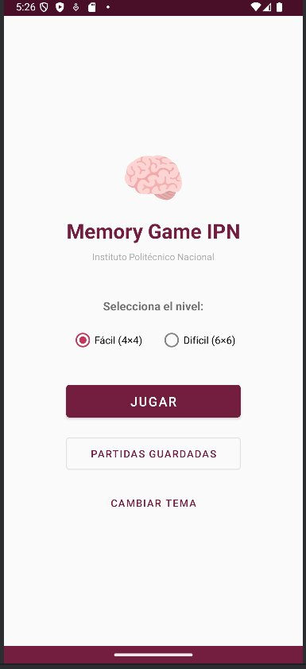
  &nbsp;&nbsp;&nbsp;
  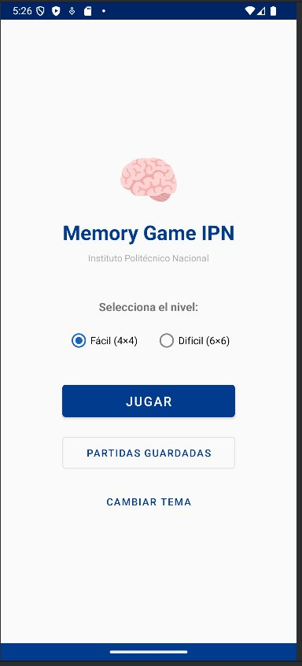
</p>
<p align="center"><i>Figura 8. Menú principal — Tema Guinda (IPN) y Tema Azul (ESCOM)</i></p>

---

### Tablero de Juego — Nivel Fácil (4×4)

El tablero muestra 16 cartas boca abajo con el ícono 🎓. Al tocar una carta se anima con una rotación 3D y se revela el emoji del par. La barra superior muestra puntuación, cronómetro y movimientos en tiempo real.

<p align="center">
  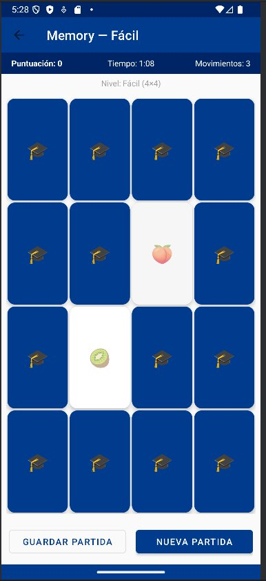
  &nbsp;&nbsp;
  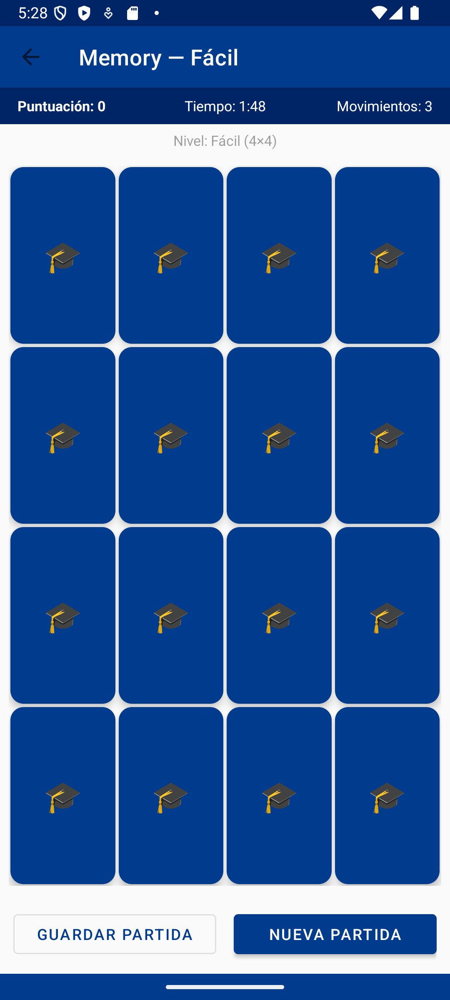
  &nbsp;&nbsp;
  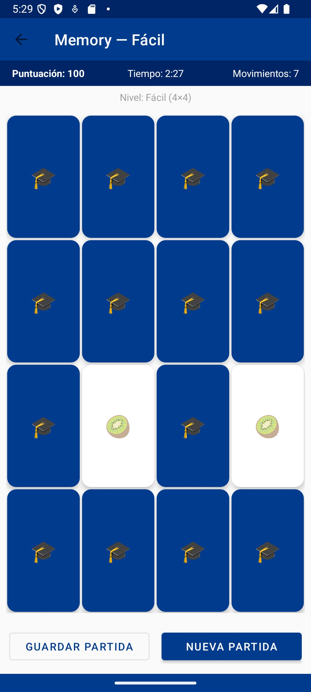
</p>
<p align="center"><i>Figura 9. Tablero Fácil con carta volteada (Guinda) — Tablero inicial (Azul) — Par de kiwis encontrado con puntuación 100</i></p>

---

### Tablero de Juego — Nivel Difícil (6×6)

El nivel difícil presenta un tablero de 36 cartas con 18 pares de emojis, aumentando significativamente la dificultad y el tiempo de juego.

<p align="center">
  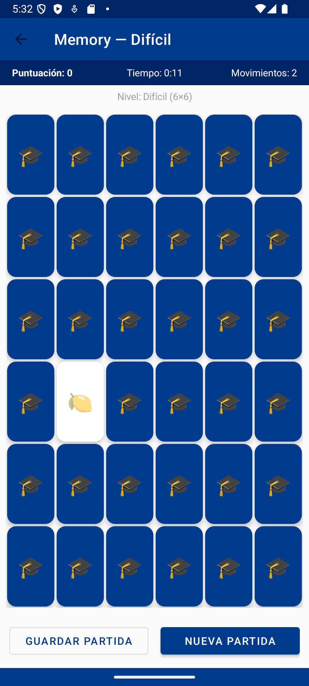
</p>
<p align="center"><i>Figura 10. Tablero Difícil (6×6) con carta de limón volteada</i></p>

---

### Guardado de Partidas

Al tocar "Guardar Partida" se muestra un diálogo donde el jugador ingresa una etiqueta personalizada y selecciona el formato de guardado: TXT, JSON o XML. Los archivos se guardan en el almacenamiento interno de la app.

<p align="center">
  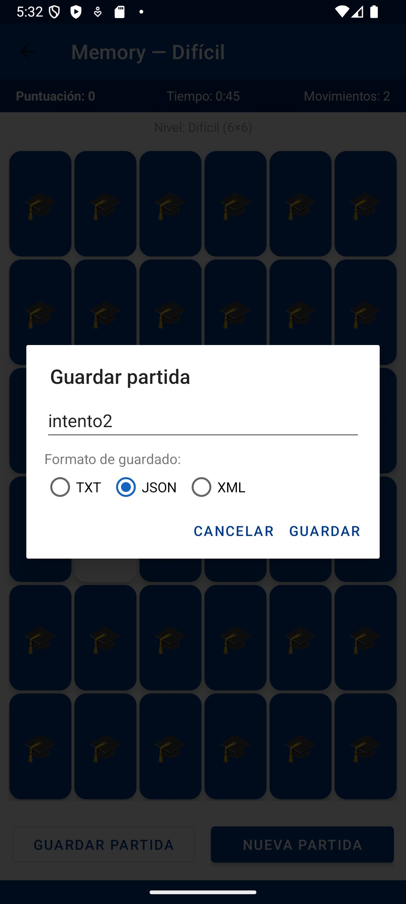
</p>
<p align="center"><i>Figura 11. Diálogo de guardado con etiqueta "intento2" y formato JSON seleccionado</i></p>

---

### Diálogo de Victoria

Al encontrar todos los pares el juego detiene el cronómetro y muestra el resumen final con puntuación, tiempo y movimientos. El jugador puede guardar la partida, iniciar una nueva o salir.

<p align="center">
  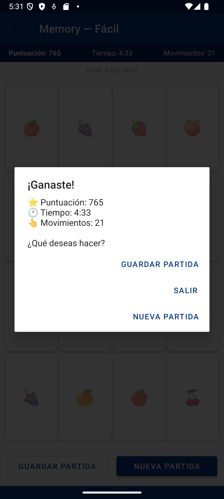
</p>
<p align="center"><i>Figura 12. Diálogo de victoria — Puntuación: 765, Tiempo: 4:33, Movimientos: 21</i></p>

---

### Visualización del Archivo de Guardado

La app permite ver el contenido crudo del archivo de guardado directamente desde la lista de partidas. Se muestra el JSON completo con todos los campos: etiqueta, nivel, puntuación, tiempo, tablero, historial y configuraciones.

<p align="center">
  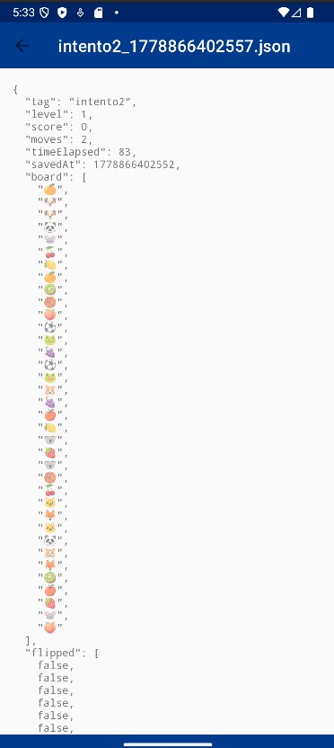
</p>
<p align="center"><i>Figura 13. Contenido del archivo intento2_1778866402557.json con todos los datos de la partida</i></p>

---

## Implementación — Memory Game IPN

### Mecánica del juego

```kotlin
// Al encontrar un par
matched[firstCard] = true
matched[index] = true
pairsFound++
score += 100

// Al fallar
score = maxOf(0, score - 5)
handler.postDelayed({
    flipCard(firstIndex, faceUp = false)
    flipCard(index, faceUp = false)
}, 900)
```

### Guardado en tres formatos

```kotlin
fun save(context: Context, state: GameState, format: String): Boolean {
    val content = when (format) {
        "TXT"  -> toTxt(state)
        "JSON" -> toJson(state)
        "XML"  -> toXml(state)
        else   -> toJson(state)
    }
    file.writeText(content, Charsets.UTF_8)
}
```

### Carga con detección automática de formato

```kotlin
fun load(file: File): GameState? = when (file.extension.lowercase()) {
    "json" -> fromJson(file.readText())
    "xml"  -> fromXml(file.readText())
    "txt"  -> fromTxt(file.readText())
    else   -> null
}
```

### Animación de volteo 3D

```kotlin
back.animate().rotationY(90f).setDuration(150).withEndAction {
    back.visibility  = View.GONE
    front.visibility = View.VISIBLE
    front.rotationY  = -90f
    front.animate().rotationY(0f).setDuration(150).start()
}.start()
```

---

# Práctica 6 — Manejo de Sensores del Dispositivo Móvil

| Campo | Datos |
|---|---|
| **Integrantes** | Bernal Ramírez Brian Ricardo / Saavedra Mata Karla Sofía |
| **Boletas** | 2023630387 / 2019300048 |
| **Asignatura** | Desarrollo de Aplicaciones Móviles Nativas |
| **Profesor** | Gabriel Hurtado Avilés |
| **Fecha de entrega** | 28 de mayo de 2026 |
| **Institución** | Instituto Politécnico Nacional — Escuela Superior de Cómputo |

---

## Introducción

La Práctica 6 extiende el Gestor de Archivos (Práctica 4) con sensores del dispositivo y comunicación Bluetooth, y desarrolla una nueva aplicación de navegación web vía Bluetooth. El objetivo es aprovechar el hardware del dispositivo móvil para crear soluciones de interconexión entre dispositivos.

---

## Ejercicio 1 — Implementación de Sensores en FileManagerIPN

### Sensores implementados

**1. Acelerómetro (`TYPE_ACCELEROMETER`)**
- Muestra los valores X, Y, Z en tiempo real (m/s²)
- Detecta el gesto de "shake" para refrescar la lista de archivos
- Algoritmo: calcula la velocidad de cambio entre lecturas; si supera el umbral de 800, se activa

```kotlin
val dx = x - lastX; val dy = y - lastY; val dz = z - lastZ
val speed = sqrt(dx*dx + dy*dy + dz*dz) / timeDelta
if (speed > SHAKE_THRESHOLD) onShakeDetected()
```

**2. Sensor de Luz Ambiental (`TYPE_LIGHT`)**
- Muestra el nivel de luz en lux en tiempo real
- Clasifica automáticamente: Oscuridad / Luz baja / Luz normal / Luz intensa / Luz solar

**3. Autenticación Biométrica (Huella Dactilar)**
- Usa `BiometricPrompt` de AndroidX para acceder a carpetas protegidas
- Maneja los tres estados: éxito, fallo y error

### Gestión eficiente de batería

```kotlin
override fun onResume() {
    // Solo activa sensores cuando la pantalla es visible
    if (accelEnabled) sensorManager.registerListener(this, accelerometer, SENSOR_DELAY_UI)
    if (lightEnabled) sensorManager.registerListener(this, lightSensor, SENSOR_DELAY_UI)
}
override fun onPause() {
    // Desregistra todos para no consumir batería en background
    sensorManager.unregisterListener(this)
}
```

### Cómo probar (Ejercicio 1)

1. Instala `FileManagerIPN` en el dispositivo
2. Abre la app → toolbar → ícono **Sensores**
3. Observa los valores del acelerómetro y luz cambiando en tiempo real
4. Agita el teléfono → aparece el mensaje "Shake detectado"
5. Desactiva un sensor con el Switch → deja de actualizarse
6. Toca **🔐 Autenticar con Huella** → usa tu huella dactilar

### Capturas necesarias (Ejercicio 1)

| # | Pantalla |
|---|---|
| 1 | Pantalla de sensores con datos en tiempo real (valores X/Y/Z del acelerómetro) |
| 2 | Mensaje de "Shake detectado" tras agitar el teléfono |
| 3 | Diálogo de autenticación biométrica (huella dactilar) |
| 4 | Resultado: "✅ Autenticación exitosa" |

---

## Ejercicio 2 — Compartir Archivos vía Bluetooth en FileManagerIPN

### Funcionalidades implementadas

- Descubrimiento de dispositivos Bluetooth cercanos via `BroadcastReceiver`
- Conexión segura RFCOMM (`createRfcommSocketToServiceRecord`)
- Envío y recepción de archivos de cualquier formato
- Progreso de transferencia en tiempo real (chunks de 4KB)
- Historial de transferencias (enviadas y recibidas)
- Cancelación de transferencias en curso
- Verificación de integridad por tamaño de archivo
- Servicio foreground `BluetoothTransferService` con notificación persistente

### Arquitectura de transferencia

```
Teléfono A (Receptor)          Teléfono B (Emisor)
─────────────────────          ──────────────────
AcceptThread                   ConnectThread
  listenUsingRfcomm()   ←→       createRfcomm()
  accept()              ←─────── connect()
                                  
ConnectedThread (servidor)     ConnectedThread (cliente)
  receiveFile()          ←      sendFile()
  [Header: nombre|size]  ←      outStream.write(header)
  [Chunks de 4KB]        ←      outStream.write(chunk)
  Verifica integridad           
```

### Permisos gestionados

```xml
<uses-permission android:name="android.permission.BLUETOOTH_CONNECT" />
<uses-permission android:name="android.permission.BLUETOOTH_SCAN" />
<!-- Android 12+ requiere permisos en tiempo de ejecución -->
```

### Cómo probar (Ejercicio 2)

1. Instala `FileManagerIPN` en **ambos teléfonos**
2. **Teléfono A** (receptor): toolbar → **Bluetooth** → toca **📥 Recibir**
3. **Teléfono B** (emisor): toolbar → **Bluetooth** → **🔍 Buscar Dispositivos**
4. Selecciona el Teléfono A de la lista → toca **Seleccionar Archivo** → elige un archivo
5. Toca **📤 Enviar** → observa la barra de progreso en ambos dispositivos
6. El archivo se guarda en `Downloads/` del Teléfono A

### Capturas necesarias (Ejercicio 2)

| # | Pantalla |
|---|---|
| 1 | Teléfono B buscando dispositivos (lista de dispositivos encontrados) |
| 2 | Progreso de transferencia en tiempo real (~50%) en ambos teléfonos |
| 3 | Historial de transferencias mostrando archivo enviado/recibido |
| 4 | Notificación del servicio Bluetooth en la barra de notificaciones |

---

## Ejercicio 3 — Navegador Bluetooth (BluetoothBrowser)

**Repositorio:** mismo repo, carpeta `BluetoothBrowser/`

> ⚠️ Esta app está desarrollada **exclusivamente con Android Nativo + XML layouts**. No usa Jetpack Compose ni frameworks de terceros, según las instrucciones de la práctica.

### Descripción

Permite que un dispositivo sin Internet (Dispositivo B) navegue por la web a través de un dispositivo con Internet (Dispositivo A), usando Bluetooth como canal de comunicación.

### Arquitectura Cliente-Servidor

```
Dispositivo A (Servidor — tiene Internet)
├── ServerActivity.kt       → Acepta conexiones BT, ejecuta peticiones HTTP
├── ProxyService.kt         → Foreground service con notificación
└── Caché LRU en memoria    → Evita descargar la misma URL dos veces

Dispositivo B (Cliente — sin Internet)
├── BrowserActivity.kt      → UI de navegador: barra de URL, historial, favoritos
└── ReaderThread            → Recibe respuestas del servidor en chunks

Compartido
└── BtProtocol.kt           → Protocolo de mensajes REQUEST/RESPONSE/PING/PONG
```

### Protocolo Bluetooth

```
Cliente → Servidor:   REQUEST:https://ejemplo.com
Servidor → Cliente:   RESPONSE_START:12345
Servidor → Cliente:   RESPONSE_CHUNK:...datos...
Servidor → Cliente:   RESPONSE_CHUNK:...datos...
Servidor → Cliente:   RESPONSE_END
```

### Funcionalidades del navegador (Dispositivo B)

- Barra de direcciones con normalización de URLs
- Botones de navegación: ⬅ Atrás / ➡ Adelante / 🔄 Refrescar
- Búsqueda en Google cuando se ingresa texto sin URL
- Historial local de navegación
- Favoritos persistidos en SharedPreferences
- Reconexión automática si se pierde la conexión
- Modo incógnito (no guarda historial)

### Temas personalizables

| Botón | Efecto |
|---|---|
| **Guinda** | Color representativo del IPN (`#731D3F`) |
| **Azul** | Color representativo de ESCOM (`#003B8E`) |
| **Oscuro** | Alterna modo oscuro manualmente (independiente del sistema) |

El modo oscuro automático usa `res/values-night/themes.xml` del sistema Android.

### Cómo probar (Ejercicio 3)

1. Instala `BluetoothBrowser` en **ambos teléfonos**
2. Vincula los teléfonos via Bluetooth (Ajustes del sistema → Bluetooth → Vincular)
3. **Teléfono A** (con WiFi/datos activos):
   - Abre la app → **Dispositivo A — SERVIDOR**
   - Toca **▶ Iniciar Servidor**
   - Espera el mensaje "Servidor iniciado — esperando conexión BT"
4. **Teléfono B** (apaga WiFi y datos celulares — visible en barra de notificaciones):
   - Abre la app → **Dispositivo B — CLIENTE**
   - Toca **Conectar** → selecciona el Teléfono A de la lista
   - Espera el indicador "● Conectado" en verde
5. Escribe `google.com` en la barra de URL → toca **IR**
6. El contenido de la página llega via Bluetooth y se renderiza como texto

### Capturas necesarias (Ejercicio 3)

| # | Pantalla | Dispositivo |
|---|---|---|
| 1 | Pantalla de selección de rol (Servidor / Cliente) | Cualquiera |
| 2 | Servidor activo con log de peticiones | Teléfono A |
| 3 | Cliente con indicador "● Conectado" en verde | Teléfono B |
| 4 | Teléfono B con WiFi y datos **desactivados** (barra superior) | Teléfono B |
| 5 | Contenido de una página web renderizado via Bluetooth | Teléfono B |
| 6 | Pantalla de selección de temas (Guinda/Azul/Oscuro) | Cualquiera |

---

## Dependencias añadidas (Práctica 6)

| Librería | Versión | Uso |
|---|---|---|
| `androidx.biometric:biometric` | 1.1.0 | Autenticación biométrica (huella) |
| Android Bluetooth API | nativa | RFCOMM, descubrimiento, transferencia |
| `SensorManager` | nativa | Acelerómetro y luz ambiental |
| `NotificationCompat` | nativa | Notificaciones de transferencia |

---

## Permisos requeridos

| Permiso | Ejercicio | Motivo |
|---|---|---|
| `USE_BIOMETRIC` | 1 | Autenticación con huella |
| `BLUETOOTH_CONNECT` | 2 y 3 | Conectar dispositivos (Android 12+) |
| `BLUETOOTH_SCAN` | 2 y 3 | Descubrir dispositivos (Android 12+) |
| `ACCESS_FINE_LOCATION` | 2 y 3 | Requerido para BT en Android < 12 |
| `FOREGROUND_SERVICE` | 2 y 3 | Servicio de transferencia en background |
| `INTERNET` | 3 | El servidor descarga páginas web |

---

## Bibliografía

- Android Developers. (2024). *SensorManager*. https://developer.android.com/reference/android/hardware/SensorManager
- Android Developers. (2024). *BiometricPrompt*. https://developer.android.com/reference/androidx/biometric/BiometricPrompt
- Android Developers. (2024). *Bluetooth overview*. https://developer.android.com/guide/topics/connectivity/bluetooth
- Android Developers. (2024). *BluetoothServerSocket*. https://developer.android.com/reference/android/bluetooth/BluetoothServerSocket
- Android Developers. (2024). *Manage battery usage*. https://developer.android.com/training/monitoring-device-state/battery-monitoring
- gabrielhuav. (2024). *BattleNaval_V2*. https://github.com/gabrielhuav/BattleNaval_V2
